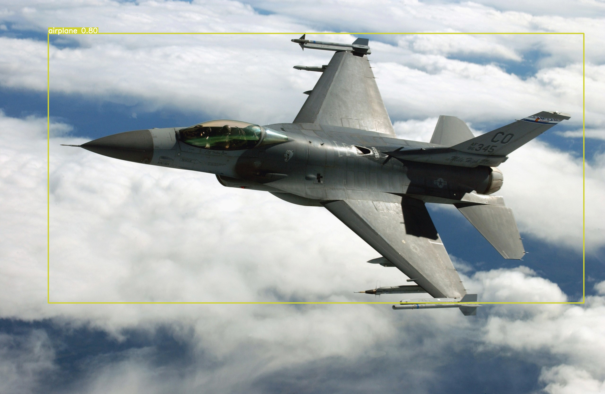
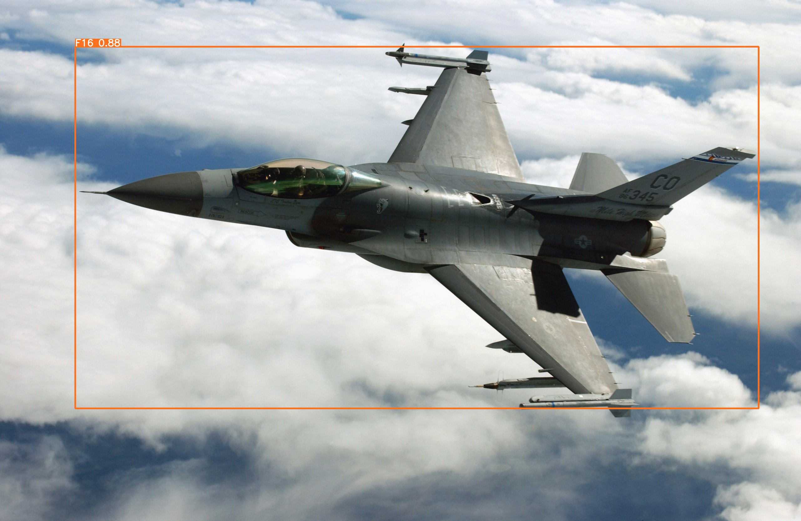
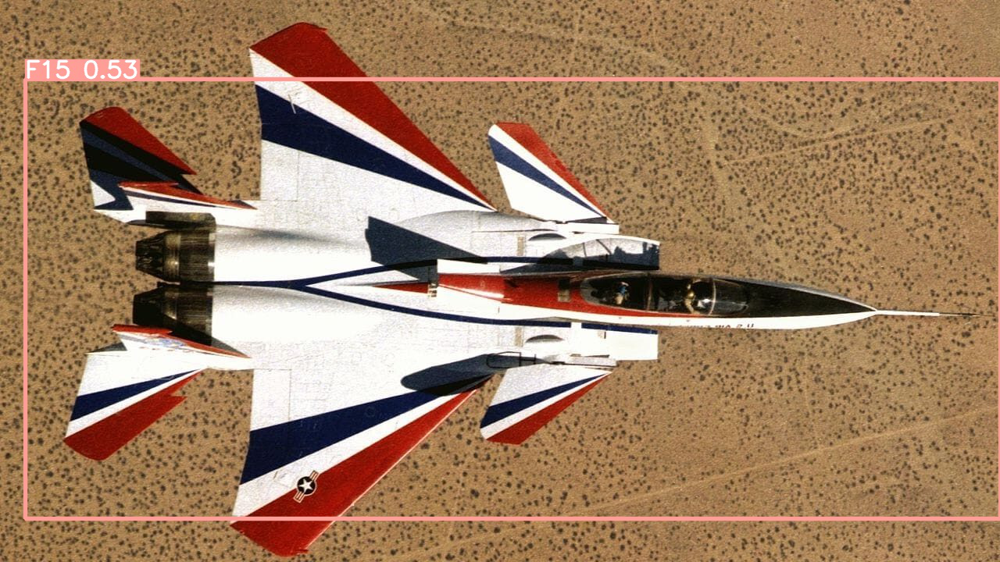
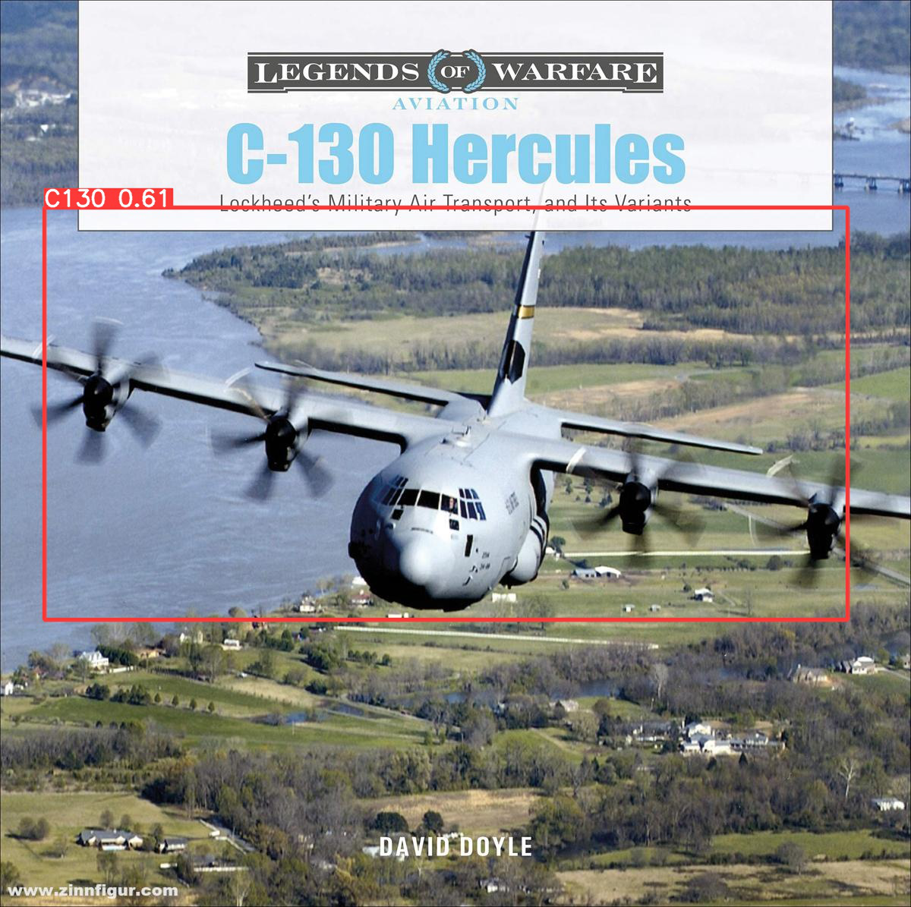
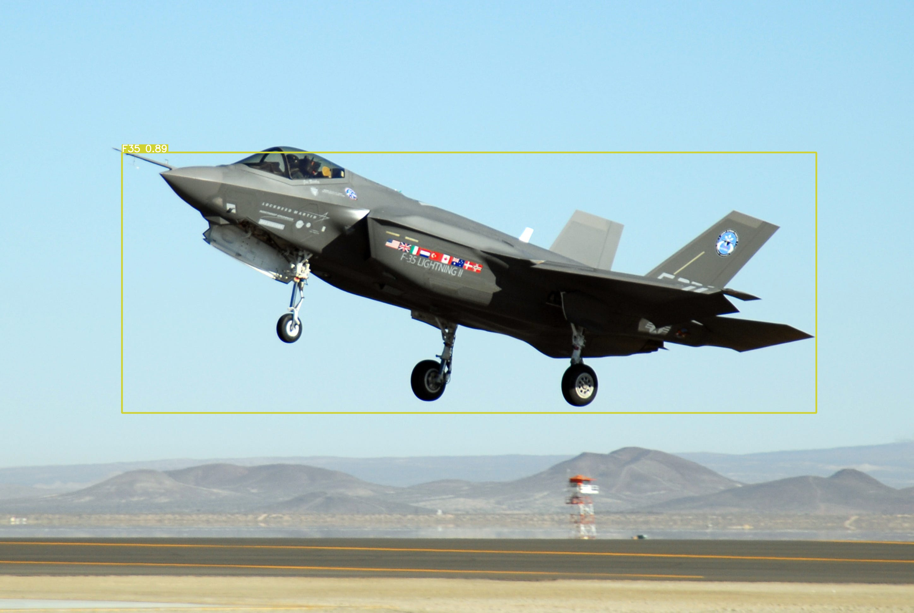

# Military Aircraft Detection using YOLOv5

This repository contains the code and resources for a computer vision project that focuses on detecting military aircraft using YOLOv5. The project utilizes a custom dataset of military planes, which can be found at [Kaggle: Military Aircraft Detection Dataset](https://www.kaggle.com/datasets/a2015003713/militaryaircraftdetectiondataset).

## Project Overview

The goal of this project is to develop a proof-of-concept object detection model capable of identifying military aircraft in images. YOLOv5, a state-of-the-art object detection algorithm, has been employed to train the model on the provided dataset. The specific aircraft models included in the training and detection process are:

- F15
- F16
- F18
- F35
- C130

Due to resource limitations, only these aircraft models have been considered. The project utilizes the Google Colab platform for both training and detection.

## Acknowledgements

This project is based on the work of a Kaggle notebook created by [changchi0914](https://www.kaggle.com/changchi0914). I express my gratitude to the author for providing a valuable template that served as the foundation for our project.

## Dataset

The dataset used for training and evaluation can be found at the following location: [Kaggle: Military Aircraft Detection Dataset](https://www.kaggle.com/datasets/a2015003713/militaryaircraftdetectiondataset). It consists of a diverse collection of images containing various military aircraft models, including the ones listed above.

## Images

Plain Yolov5 detection of an F16:

  

Detection using the custom trained dataset:
<table align="center">
  <tr>
    <td>
      
    </td>
    <td>
      
    </td>
  </tr>
  <tr>
    <td>
      
    </td>
    <td>
      
    </td>
  </tr>
  <tr>
    <td>
      
    </td>
    <td>
      
    </td>
  </tr>
</table>

## License

This project is licensed under the [MIT License](https://opensource.org/licenses/MIT). Please refer to the `LICENSE` file for more information.

## References

1. Kaggle: Military Aircraft Detection Dataset - [Link](https://www.kaggle.com/datasets/a2015003713/militaryaircraftdetectiondataset)
2. Kaggle Notebook: Military Aircraft Detection with YOLOv5 - [Link](https://www.kaggle.com/code/changchi0914/militaryaircraftdetectionyolov5)
3. YOLOv5 GitHub Repository - [Link](https://github.com/ultralytics/yolov5)
